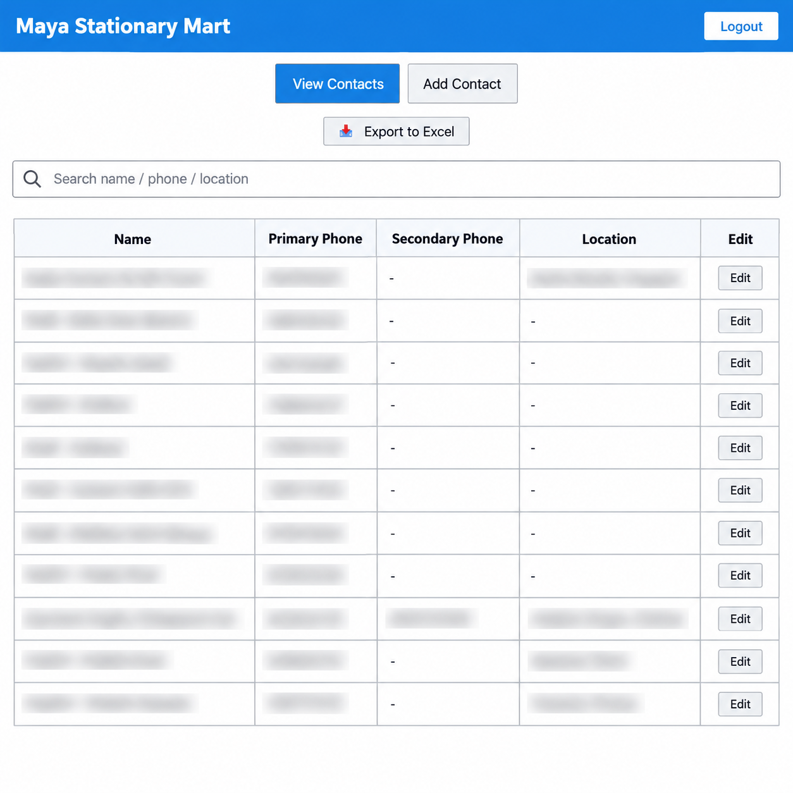
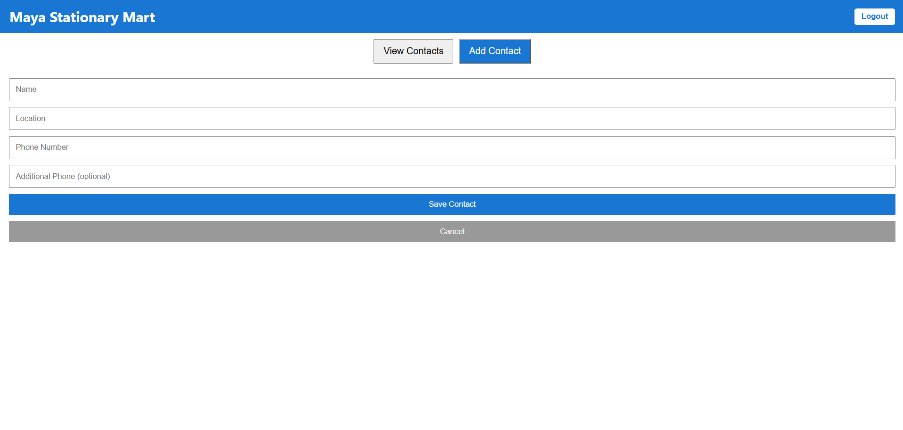
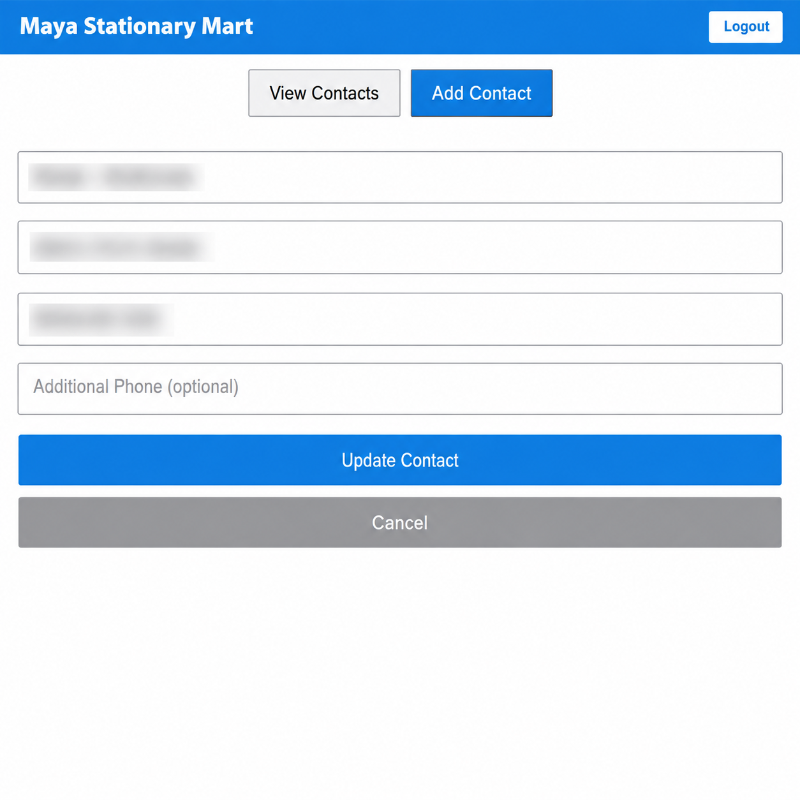
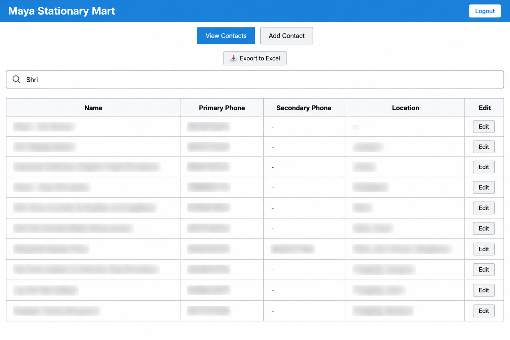

# Shop Directory Management System

A web-based contact management application built using **React.js and Firebase** to organize, search, and manage shop contact information efficiently.

The application provides secure authentication, real-time cloud data storage, advanced search and filtering, and Excel export functionality through a simple, responsive interface.

### [Live Demo](https://maya-stationary-phonebook.web.app)

## Features

### 1. Shop Contact Management
- Add, view, edit, and delete shop contact records.
- Store shop names, locations, and multiple phone numbers.
- Manage contact information through an organized interface.
- Update records directly in the cloud database.

### 2. Advanced Search and Filtering
- Search shops by name, location, or phone number.
- Quickly locate records without manually browsing the directory.
- Filter contact records for easier navigation.

### 3. Secure Authentication
- User authentication using Firebase Authentication.
- Restricted access to authorized users.
- Protected contact management functionality to prevent unauthorized modifications.

### 4. Excel Export
- Export shop contact information into an Excel-compatible file.
- Simplify offline record management, reporting, and data sharing.

### 5. Cloud-Based Data Management
- Firebase Cloud Firestore for persistent contact storage.
- Support for creating, updating, retrieving, and deleting records.
- Cloud-hosted application accessible through a web browser.

## Tech Stack

| Category | Technologies |
|---|---|
| Frontend | React.js, JavaScript, HTML, CSS |
| Authentication | Firebase Authentication |
| Database | Cloud Firestore |
| Hosting | Firebase Hosting |
| Version Control | Git, GitHub |

## Application Architecture

The application follows a client-side architecture integrated with Firebase services.

```text
                   User
                    |
                    v
             React.js Frontend
                    |
           +--------+--------+
           |                 |
           v                 v
    Firebase Auth      Cloud Firestore
           |                 |
     User Sign-in       Contact Records
     Access Control     CRUD Operations
                             |
                             v
                      Search / Filter
                      Excel Export
```

### How It Works

1. Users authenticate through Firebase Authentication.
2. Authorized users access the shop directory interface.
3. Contact records are retrieved from Cloud Firestore.
4. Users can search, filter, add, update, or delete shop records.
5. Contact data can be exported for offline use.

## Screenshots

### Dashboard


### Add / Edit Contact



### Search and Filtering


## Getting Started

### Prerequisites

- Node.js and npm
- A Firebase project with Authentication and Firestore configured

### 1. Clone the Repository

```bash
git clone https://github.com/muskan191103/shop-directory.git
cd shop-directory
```

### 2. Install Dependencies

```bash
npm install
```

### 3. Configure Firebase

Set up a Firebase project and enable the authentication provider used by the application, along with Cloud Firestore.

Configure the Firebase initialization file with your project's web app configuration.

Ensure that Firestore security rules restrict access appropriately.

> Firebase web configuration is not a substitute for authentication and database security rules. Never commit service-account private keys or other secrets.

### 4. Start the Development Server

For a Create React App setup:

```bash
npm start
```

For a Vite setup:

```bash
npm run dev
```

Use the command supported by the repository's `package.json`.

## Deployment

The application is deployed using **Firebase Hosting**.

Live application: https://maya-stationary-phonebook.web.app

For a configured Firebase Hosting project, deployment can be performed using:

```bash
firebase deploy --only hosting
```

## Future Improvements

- Bulk import of shop records from Excel or CSV files.
- Duplicate contact detection and merging.
- Pagination for larger contact directories.
- More granular role-based access control.
- Improved mobile responsiveness and usability.

## Author

**Muskan Agrawal**

- [GitHub](https://github.com/muskan191103)
- [LinkedIn](https://www.linkedin.com/in/muskan-agrawal-95b551280/)

## License

No open-source license is specified for this project. All rights are reserved unless a license is added.
